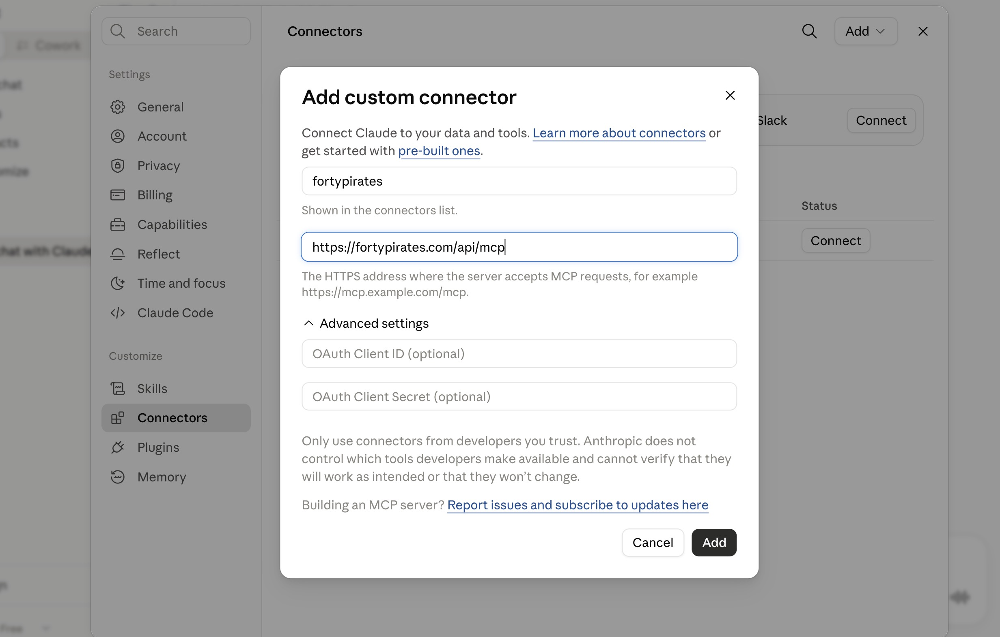

# Forty Pirates for Claude Code

Your travel workspace, in conversation. Ask what you've saved, build a list or a map
of places just by naming them, and tidy up what's already there — in plain English.

## Get it

Paste these two lines into Claude Code:

```
/plugin marketplace add contextforce/fortypirates-skill
/plugin install fortypirates-workspace@fortypirates
```

## First time

Just ask it something. You'll get a link — open it, click **Allow**, done. Nothing to
copy, nothing to set up, and you won't be asked again.

You'll need a free account at [fortypirates.com](https://fortypirates.com).

## Try asking

> What have I saved in Tokyo?

> Make me a list of matcha cafés in Kyoto

> Make a map of the best ramen in Shibuya

> Add the Ghibli Museum to my Tokyo list

> What's in my Japan list?

It finds the real places, saves them with photos, and gives you a link to open.

## Claude Desktop / claude.ai

No plugin needed — add it as a connector:

1. **Settings → Connectors → Add → Add custom connector**
2. Fill in two fields:

   | | |
   |---|---|
   | **Name** | `fortypirates` |
   | **URL** | `https://fortypirates.com/api/mcp` |

3. Leave the OAuth fields under *Advanced settings* **empty** — they're optional and
   not needed.
4. Click **Add**. You'll be asked to sign in and click **Allow**, once.



Then ask it the same things as above.

Other assistants that support MCP connectors work the same way: give them that URL.

## Your stuff stays yours

Lists are private unless you share them. To disconnect Claude Code from your account,
visit [fortypirates.com/settings/cli](https://fortypirates.com/settings/cli) and click
disconnect — it stops working immediately.
